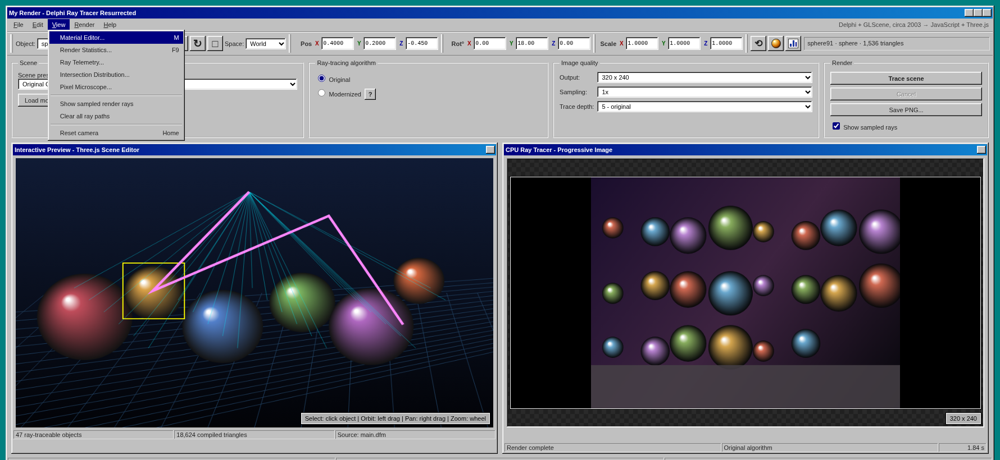
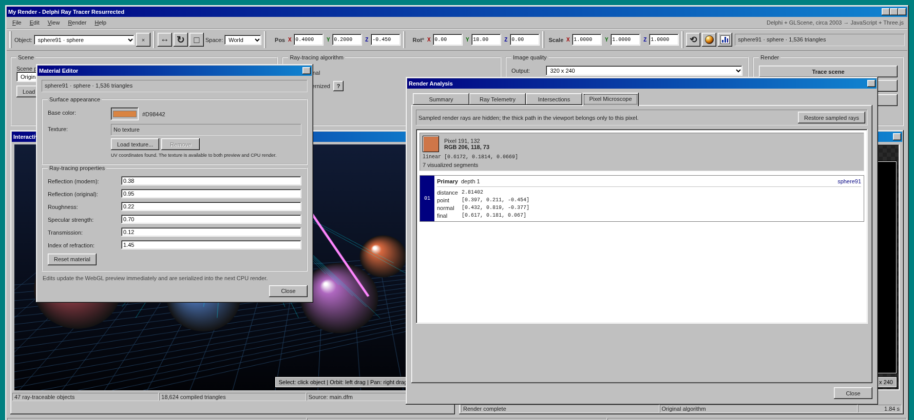

# My Old Raytracer Toy

A browser resurrection of a Delphi/Object Pascal and GLScene CPU ray tracer written around 2003.

The application now deliberately looks like a small Windows 98-era graphics utility while behaving like a modern interactive ray-tracing laboratory. The left viewport is a live Three.js scene editor. The right viewport is **not** a WebGL screenshot: a recursive JavaScript CPU ray tracer reconstructs it progressively, pixel by pixel, inside a Web Worker.

The original scene, Pascal implementation, Delphi form definition, project files, and bundled `.3ds` models remain part of the repository.

## Try it online

[Launch My Old Raytracer Toy](https://ivansivak.com/projects/raytracer)





> Both screenshots are generated from the current `mountLayout()` output and project CSS in headless Chromium. The viewport pictures are illustrative fixtures used only for documentation; the application itself uses live Three.js and Worker-rendered canvases.

## Run it

Vite 8 requires a recent Node.js release. Use Node.js `20.19+` or `22.12+`.

```bash
cd my-render-web
npm install
npm run dev
```

Open the local address printed by Vite, normally:

```text
http://localhost:5173
```

For the closest reconstruction of the old program, select:

```text
Scene:     Original GLScene composition
Algorithm: Original
Output:    512 × 384 — original
Sampling:  2× — original
Depth:     5 — original
```

For a faster first look, the default 320 × 240, 1× configuration is intentionally lighter.

## Production build

```bash
npm run build
npm run preview
```

The static build is emitted to `dist/`. `vite.config.js` uses a relative asset base, so the result can be hosted at a domain root or in a static subdirectory. A Cloudflare Pages configuration can use:

```text
Build command:    npm run build
Output directory: dist
```

## Typical workflow

1. Orbit with the left mouse button, pan with the right mouse button, and zoom with the wheel.
2. Click a mesh in the preview—or choose it from the object list—to select it.
3. Move, rotate, or scale the selection with the viewport gizmo or numeric fields.
4. Open the Material Editor from its sphere button or **View → Material Editor**, then adjust color, texture, and optical properties.
5. Choose **Original** or **Modernized**, then set resolution, sampling, and recursion depth.
6. Press **Trace scene** or use **Render → Trace scene** / `F10`.
7. Open **Render Analysis** from its toolbar button, the View menu, or `F9`.
8. Click a rendered pixel. The representative ray cloud is hidden and the selected pixel’s thicker path is isolated in the 3D preview.
9. Restore sampled rays from the Pixel Microscope tab, or save the result as PNG.

Changing the camera, an object transform, a material, or a texture marks the existing result as stale. The next render compiles the edited Three.js scene into a fresh CPU-ray-tracing payload.

### Custom models

The **Load model...** button accepts:

- `.glb` — recommended because geometry, materials, and textures can live in one file
- self-contained `.gltf`
- `.3ds`
- `.obj`

The loaded object is centered, scaled to a practical size, placed on a generated ground plane, and compiled into the same triangle representation used by the CPU ray tracer.

Browser-readable texture maps can be serialized for CPU rendering. External images that are absent, not yet loaded, or protected from canvas readback are skipped with a visible warning rather than failing the entire render.

## Historical source policy

The published archive contains:

```text
legacy/delphi/main.pas
legacy/delphi/main.dfm
legacy/delphi/my_render.dpr
legacy/delphi/ProjectGroup1.bpg
```

The point of this project is not to hide the old implementation behind a new renderer. Three.js supplies the interactive window and editor; the recursive CPU algorithm remains the heart of the resurrection.
